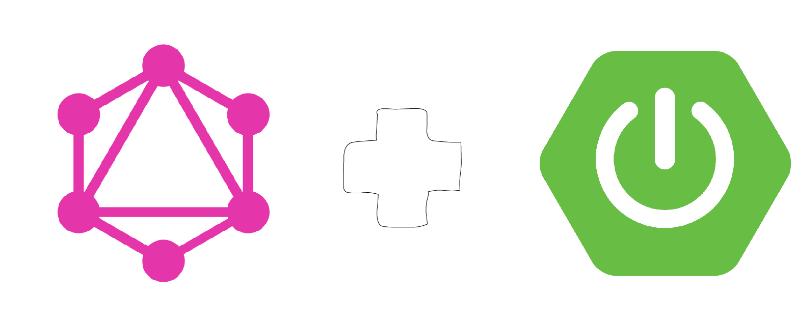
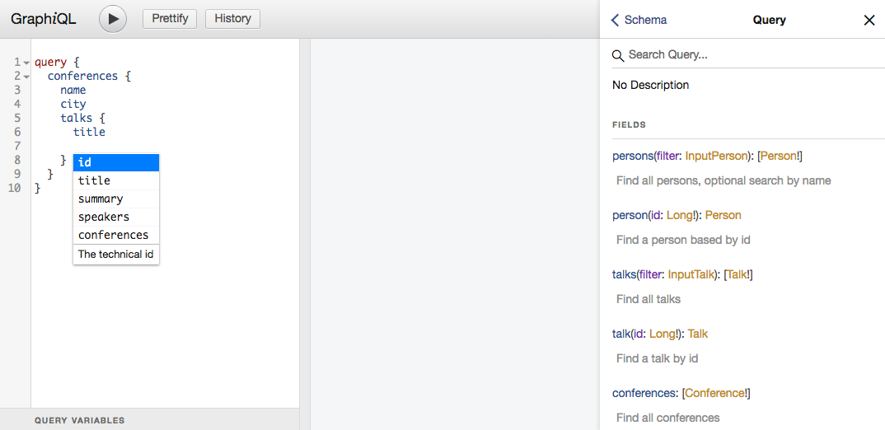

[](https://travis-ci.com/npalm/graphql-java-demo)
[](https://codeclimate.com/github/npalm/graphql-java-demo/maintainability)
[](https://codeclimate.com/github/npalm/graphql-java-demo/test_coverage)
[](https://hub.docker.com/r/npalm/graphql-java-demo/)
[](https://snyk.io//test/github/npalm/graphql-java-demo?targetFile=build.gradle)

# GraphQL demo service

<!-- TOC depthFrom:2 depthTo:3 withLinks:1 updateOnSave:1 orderedList:0 -->

- [GraphQL demo service](#graphql-demo-service)
  - [Introduction](#introduction)
  - [Application](#application)
  - [Run with docker](#run-with-docker)
  - [Example usages](#example-usages)
  - [Build and Run](#build-and-run)
    - [Gradle](#gradle)
    - [Docker](#docker)
  - [Test data](#test-data)

<!-- /TOC -->

#TL;TR

Execute the `start.sh` script to build and start the container via compose. Once started you can experiment with GraphQL via [GraphQL Playground](https://github.com/prisma-labs/graphql-playground), [GraphiQL](https://github.com/graphql/graphiql) or [Altair](https://github.com/imolorhe/altair)
```
./start.sh
```

## Introduction

This repo contains a simple Spring Boot (2.x) service that implements  [GraphQL](https://graphql.org/) API. The implementation is based on graphql-java-tools a GraphQL java library inspired by Apollo.



- [graphql-java-common](https://github.com/graphql-java/graphql-java-tools) - GraphQL implementation which is a schema first implementation of GraphQL.
- [graphql-spring-boot](https://github.com/graphql-java/graphql-spring-boot) - A Sprinb Boot Starter for GraphQL.
- Spring Boot 2.x

## Application
The application implements GraphQL on top of JPA repositories. The application provides basic functionality to store Conferences, for a conferences a set of Talks, for each Talk a set of speakers. And for each Talk comments can be made.


The graphQL API contains *queries*, *mutations* and *subscriptions*. For a Conference a basic query is available. For Person and Talk a basic filtering is implemented in the query, and for Comments an experiment with pagination is available. For more details have a look at the [schema](src/main/resources/demo.graphqls)

## Run with docker
Pull and run the image.

```
docker run -d --name postgres:12 \
docker run -d --name grapql-demo -p 8080:8080 npalm/graphql-java-demo
```

The following endpoints are now available:
- http://localhost:8080/graphiql - GraphQL IDE - GrahphiQL
- http://localhost:8080/playground - GraphQL IDE - Prisma GraphQL Client
- http://localhost:8080/altair - GraphQL IDE- Altair GraphQL Client
- http://localhost:8080/ - A simple reacte
- ws://localhost:8080/subscriptions


## Example usages

Examples below show the usages of GraphiQL IDE. GraphQL IDE's playground and altair are enabled as well.

Once the application is running point a browser to [http://localhost:8080/graphiql](http://localhost:8080/graphiql). Which will open the GraphQL IDE. Here you can simple enter GraphQL queries. Since GraphQL is based on a schema you have completion features and documentation directly available in the browser.


The system contains out-of-the box some basic test date. So why not start exploring by entering some queries. So let's get for all the conferences a list of talks with the speakers name.
```graphql
query {
  conferences {
    name
    city
    talks {
      id
      title
      speakers {
        name
      }
    }
  }
}
```

Data can be added via mutations, so next we add "John" via a GraphQL mutation..
```graphql
mutation {
  addPerson(person: {name: "John Doe"}) {
    id
  }
}
```

We can subscribe for new comments made on a talk via the GrapQL subscribtion API. Subscribing for an event works in the same way as query you define the data structure in which you are interested. Next we subscribe for upates on notes.
Via subscriptions you can get updates via a web socket about new Notes is. So first we subscribe to the notes, enter the following query.
```graphql
subscription {
  comments {
    comment
    author
    talk {
      title
    }
    createdOn
  }
}
```
The response should like as follow.
```
"Your subscription data will appear here after server publication!"
```

Finally make a comment via a mutation in a *new* browser window. Find a talkId in the result of the first query.
```graphql
mutation {
  addComment(comment: {comment: "Cool", author: "Me", talkId: 12}) {
    createdOn
    id
  }
}
```
Have now a look on the subscription window, here the update should be visible.

## Build and Run

Be aware that the React app is not part of this repo but linked as a GIT submodule. Either clone the repo with `--recurse-submodules` or after checkout run `git submodule update --init --recursive` to update the module.

### Gradle

To build the Java application just run:
```
./gradlew build
```

To run the application run, this does not contain the React app:
```
./gradlew bootRun
```

To run the React app:
```
cd react-web
yarn && yarn start
```

### Docker
The Docker file build both the Java and React app to a single Jar and package the in a docker image.

Build image
```
docker build -t grahpql-demo .
```
Run the container
```
docker run -it --rm -p 8080:8080 graphql-demo
```

Now the container should be running and you can play around with GraphQL.


## Test data
During application start some test data is loaded. Test data is defined in the following files.
- `src/main/resources/csv/confrences.csv` : The conferences
- `src/main/resources/csv/spakers.csv` : The speakers
- `src/main/resources/csv/talks.csv` : The talks, speakers and conferences can be a comma separated list between double quotes. Matching is done based on name.